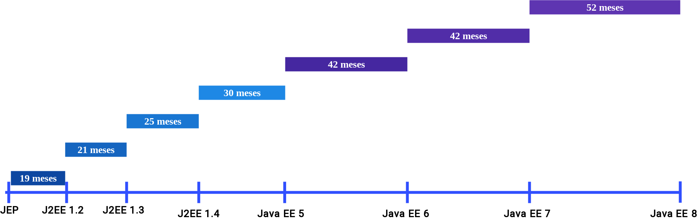

# Microprofile

## Definiciones

* Es un set de especificaciones para microservicios escritos en Java.
* Gobernancia y Contribuciones
  * Gobernado por miembros de la comunidad.
  * No es gobernado por un mismo vendedor.

## Características
*	Componentes vía servicios
*	Organizado en torno a las capacidades empresariales.
*	Productos no proyectos.
*	Puntos finales inteligentes y tuberías tontas.
*	Gobierno descentralizado.
*	Gestión de datos descentralizada.
*	Automatización de infraestructura.
*	Diseño para el fracaso.
*	Diseño evolutivo.

## Introducción a Eclipse MicroProfile
	

	
### 12 APIS
* **Microprofile Config.**  Direcciona la necesidad para cambiar  el entorno de los parametros como una aplicación o microservicio por las fases de desarrollo, pruebas unitarias, pruebas e intragración, preproducción, entornos productivos.
  
* **Microprofile Fault Tolerance**.  Povee diferenes estrategias para cuando una aplicación o microservicio encuentra un fallo.

* **Microprofile JWT Propagation**.  Maneja la propagación de la seguridad a traves de los microservicios.

* **Microprofile Health Check**.  Satisface la necesidad de sondera el estado de un nodo informático desde otra máquina, tal como un controlador de un servicio de Kubernetes.

* **Microprofile Metrics**.  Monitorea los parametros esenciales de un servicio que está corriendo.

* **Microprofile Open API**.  Provee interfaces Java y programa modelos para nativamente producir documentos OpenAPI v3 para servicios RESTful que pueden facilitar la administracióin de los API's de los microservicios.

* **Microprofile Open Tracing**.  Define la especificación para equipar microservicios que se pueden rastrear en un entorno altamente distribuido donde los mensajes pueden atravesar diferentes niveles y servicios arquitectónicos.

* **Microprofile REST Client**.  Proporciona un enfoque de tipo seguro para invocar servicios RESTful a través de HTTP de una manera consistente y fácil de reutilizar.

* **CDI**.  Maneja todo los aspectos de injección de dependencias.

* **JSON-P**.  Procesamiento de objectos JSON.

* **JAX-RS**.  Maneja todos los aspectos relacionados la comunicación RESTful .

* **JSON-B**.  Mapeo de Objetos a JSON.

## Versiones

